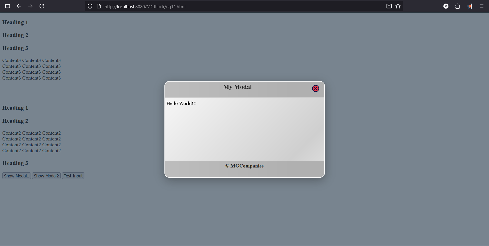
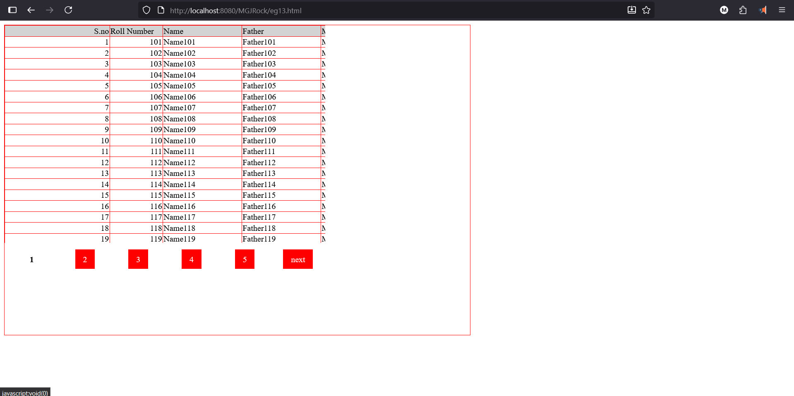

# MGJRock JS Library

A lightweight, modern JavaScript library featuring essential components and utilities for building elegant, responsive web interfaces.

## Features

- **AJAX Utility**  
  Simplifies asynchronous server communication with easy-to-use methods.

- **Autofill Combo Box**  
  Enhanced combo box with autocomplete capabilities for better user input experience.

- **Form Validation**  
  Built-in validation support with user-friendly feedback and error display.

- **Modal Component**  
  Responsive and beautifully styled modal dialogs with animations, flexible content areas, and customizable header/footer.

- **Grid Component**  
  Flexible grid layouts for displaying tabular or card content with sorting and configurable columns.

- **Accordion Pane**  
  Collapsible panels for organizing and toggling content visibility smoothly.
## Installation

Download The MGJRock.js file and include it in your code
```bash
  <script src='../js/MGJRock.js'></script>
```
# Sample Code To Demonstrate
## 1. AJAX
How to Use AJAX Feature

### GET 
```bash
  $$$.ajax({
  "url":"servletOne",
  "methodType":"GET",
  "success":function(responseData)
  {
  //use responseData as you want 
  //If It is in JSON form already parsed
  },
  "failure":function()
  {
  alert("Some Problem");
  }
  });
```

### POST and JSON
```bash
$$$.ajax({
"url":"servletThreeJSON",
"methodType":"POST",
"success":function(responseData){
var splits=responseData.split(",");
details.html("First Name - "+splits[0]+" ,Last Name - "+splits[1]+" ,Age - "+splits[2]);
},
"failure":function(){
alert("someProblem");
},
"data":{
"firstName":firstName,
"lastName":lastName,
"age":age,
},
"sendJSON":true
});
```

## 2. Accordian Pane
Just use accordian=true attribute
#### Strictly Follow This Structure
 Main Div
    <h3>Your Title Here</h3>
    <div>Your Content Here</div>
  Main Div Ends Here  
```bash
<div accordian="true">
<h3>Heading 1</h3>
<div>
Content1 Content1 Content1<br>
Content1 Content1 Content1<br>
</div>
<h3>Heading 2</h3>
<div>
Content2 Content2 Content2<br>
Content2 Content2 Content2<br>
</div>

</div> <!--main div ends here-->
```

## 3. Modal

Everything is achieved using Attributes
```bash
<div style='display:none' id='ab' forModal="true" size="600x300" 
header="some header" footer="some footer" closeButton="true" 
maskColor="#3355ff" modalBackgroundColor="#549933" beforeOpen="open
()" beforeClose="close()" afterOpen='abOpened()' 
afterClose='abClosed()'>

Your Content Here

</div>

```

## 4. AutoFill ComboBox
```bash
$$$.ajax({
"url":"servletOne",
"methodType":"GET",
"success":function(data){
var designationsComboBox=$$$("designationCode");

designationsComboBox.fillComboBox({
"dataSource":data,
"text":"title",
"value":"code",
"firstOption":{
"text":"<select designation>",
"value":"-1"
}
});
},

"failure":function()
{
alert("Faliure");
}
});
```

## 5. Grid

```bash
window.addEventListener('load',function()
{
var headerDivision=document.querySelector(".mgjrock_mggrid_headerDivision");
var bodyDivision=document.querySelector(".mgjrock_mggrid_bodyDivision");
bodyDivision.addEventListener("scroll",function(){
headerDivision.scrollLeft=bodyDivision.scrollLeft;
});
var students=new Array();
for(var x=101;x<=300;x++)
{
students.push(new Student(x,"Name"+x,"Father"+x,"Mother"+x));
}
model.grid=new Grid("mainDataTable","paginationTable",students,25);
});
</script>
</head>
<body>
<div class='somestyle'>
<div class='mgjrock_mggrid_headerDivision'>
<table class='mgjrock_mggrid_head'>
<tr>
<td>S.no</td>
<td>Roll Number</td>
<td>Name</td>
<td>Father</td>
<td>Mother</td>
</tr>
</table>
</div>
<div class='mgjrock_mggrid_bodyDivision'>
<table class='mgjrock_mggrid_body' id='mainDataTable'>
</table>
</div>
<div class='mgjrock_mggrid_paginationDivision'>
<table  id='paginationTable' class='mgjrock_mggrid_pagination'>
</table>
</div>
</div>
</body>
</html>
```
## Demo




